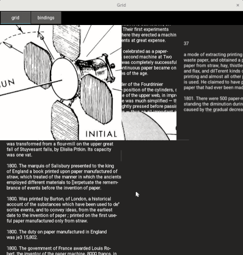
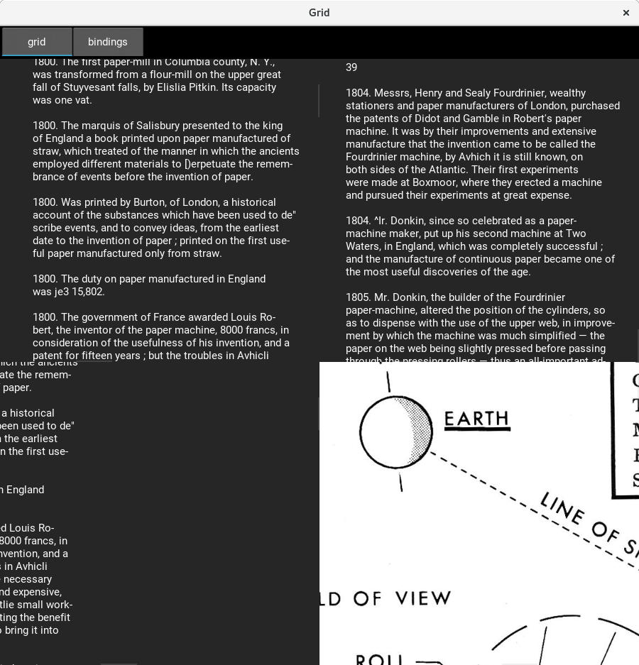
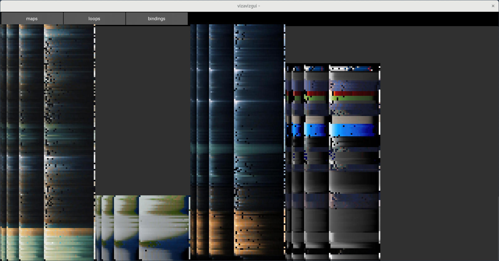
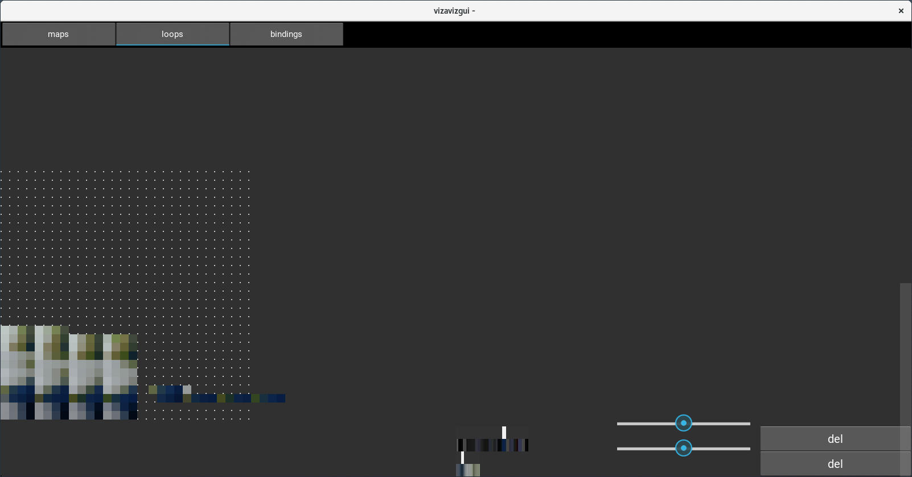
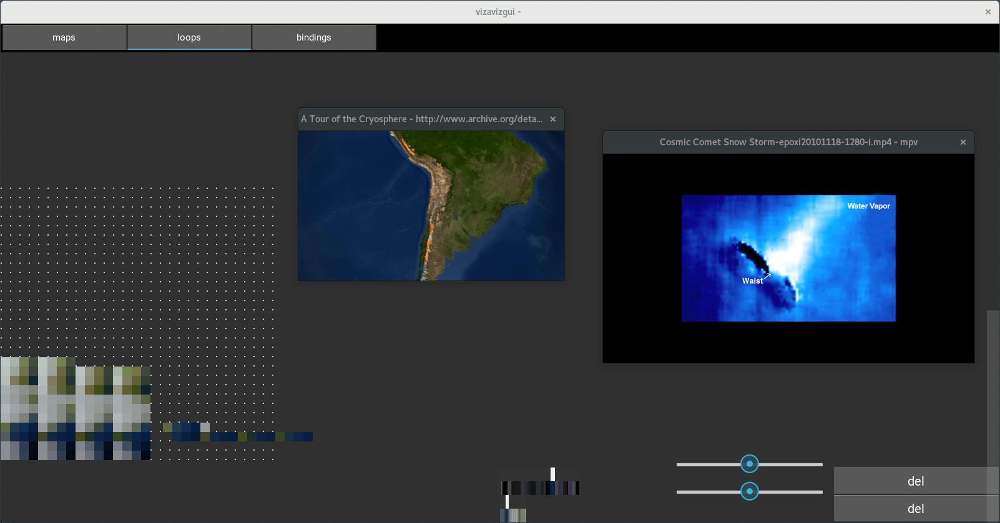
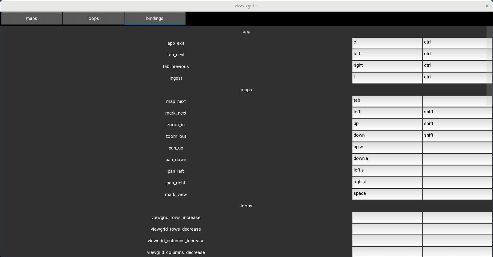
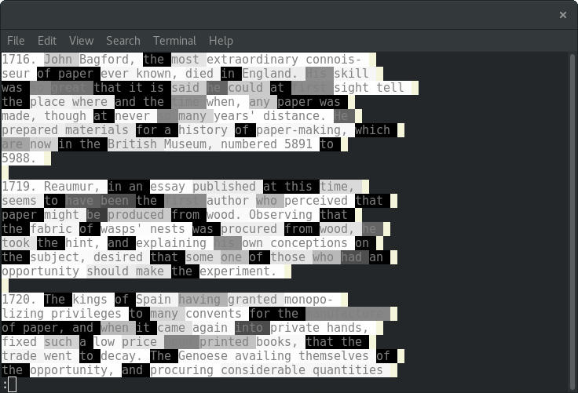
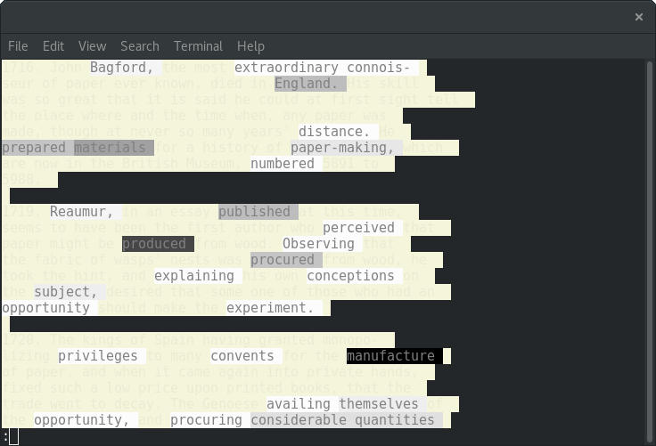
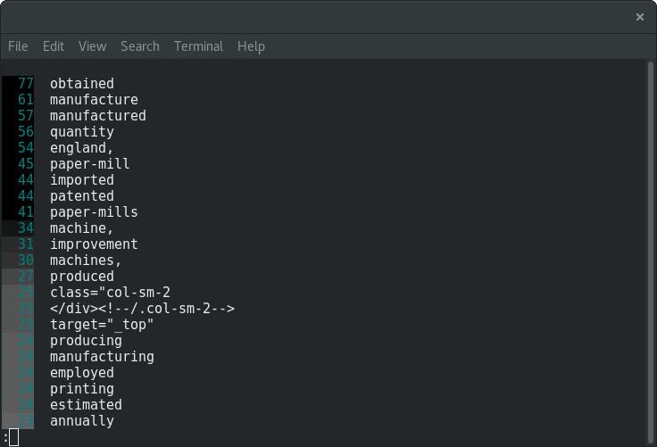

# visual annex

**studies**
_(various)_

* [grids](#grids)
_navigate nested grids of text and image_
* [word-sea](#word-sea)
_criteria-based hightlighting of text in terminal_
* [vizaviz](#vizaviz)
_navigate and loop video from a 2d plane_

**machinic**
_(involving the machinic ecosystem)_

* [dss-ui](#dss-ui)
_domain specific structures_
* [fold-lattice-ui](#fold-lattice-ui)
_visualize ingested material_
* [qma-ui](#qma-ui)
_visualize work-in-progress queues_


## dss-ui
[https://github.com/galencm/dss-ui](https://github.com/galencm/dss-ui)

## fold-lattice-ui
[https://github.com/galencm/fold-lattice-ui](https://github.com/galencm/fold-lattice-ui)

## grids
[https://github.com/galencm/grids](https://github.com/galencm/grids)



animated gif showing cell panning and movement through nested grids.

( gif created using [peek](https://github.com/phw/peek "https://github.com/phw/peek") and resized with [gifsicle](https://github.com/kohler/gifsicle "https://github.com/kohler/gifsicle") )



```
grids --size=900x900 chronology1798_1805.txt chronology1798_1805.txt chronology1798_1805.txt 289956main_lochart.full.2_full.jpg
```

`grids` with multiple files loaded.

## qma-ui
[https://github.com/galencm/qma-ui](https://github.com/galencm/qma-ui)

## vizaviz
[https://github.com/galencm/vizaviz](https://github.com/galencm/vizaviz)


```
python3 vizaviz_gui.py
```

`vizaviz_gui` with four videos (maps) displayed. Video start is at bottom, end at top. Each row is a second with a column of pixels that show most frequent colors. In this case columns of 1, 4, 8, 16, 32 are all shown in a single image for a video.

A process of `vizaviz` and `redis-server` must be running. `vizaviz` and `vizaviz_gui` interact by adding/deleting/modifying values on the redis server. The idea is to allow everything to run on a single box and more flexible configurations such as a box running vizaviz and displaying videos while multiple users are able to interact by connecting to the box. Realtime user field-of-view on the maps is displayed on all guis.



zoom in / enlarge maps


Spectrograms toggled using `tab` if they have been generated.



Loops tab allows more granular adjustment of loop. Here the video and loop are shown at at a resolution of 4 pixels with a column width of 32. The loop region is adjacent. The right side shows all loops currently running.



Mpv playing loops. Loops are run with `mpv` which `vizaviz` controls using mpv's json ipc protocol over a named pipe.



Many potential keybindings for videogame-like approach to rapidly navigate, modify and interact. 

## word-sea
[https://github.com/galencm/word-sea](https://github.com/galencm/word-sea)



```
ws chronologyofpape01muns_djvu.txt | less -R
```

`ws` run without any arguments. Words are colored by frequency in greyscale. Piping the command through `less -R` allows scrolling.



```
ws chronologyofpape01muns_djvu.txt --length-threshold 8 | less -R
```

`ws` run with an argument to ignore words less than the specified length. Ignored words are beigelisted: colored beige instead of greyscale and not used in calculations.



```
ws chronologyofpape01muns_djvu.txt --length-threshold 8 --key-only | less -R
```

`ws` run with an argument to show only the key which shows in sorted order the word by wordcount, coloring used in display and word.
