# visual annex

**studies**
_(various)_

* [grids](#grids)
_navigate nested grids of text and image_
* [word-sea](#word-sea)
_criteria-based hightlighting of text in terminal_
* [vizaviz](#vizaviz)
_navigate and loop video from a 2d plane_

**machinic**
_(involving the machinic ecosystem)_

* [dss-ui](#dss-ui)
_domain specific structures_
* [fold-lattice-ui](#fold-lattice-ui)
_visualize ingested material_
* [qma-ui](#qma-ui)
_visualize work-in-progress queues_


## dss-ui
[https://github.com/galencm/dss-ui](https://github.com/galencm/dss-ui)

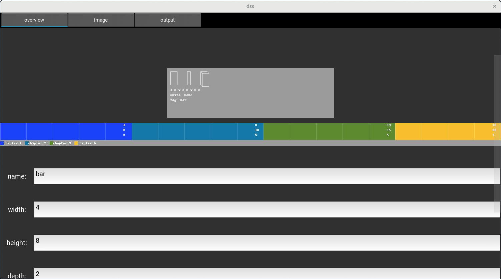

set various predefined or arbitrary metadata for project. Some metadata might be used as criteria for sequencing projects using `qma-ui` and adjusting device settings.

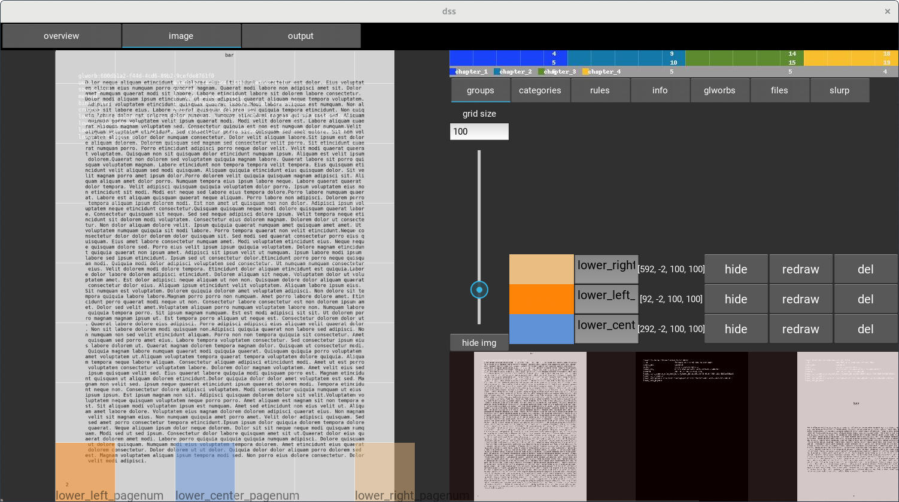

select regions of image to identify and process in some manner. In this case potential regions where page numbers are found. Generated xml can be used to setup ocring of regions(see _pipeling_ and _routeling_ in [machinic-lings](https://github.com/galencm/machinic-lings "https://github.com/galencm/machinic-lings")). Rules can use the results of these regions for classifying glworbs in categories. 

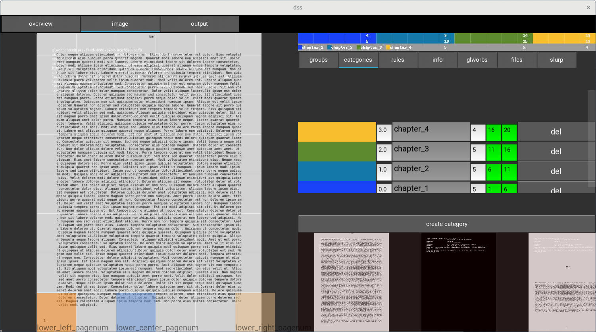

salient subunits of a project, possibly with a sequence, amount and start/end. Can be used to verify ordering, missing or uncertain items. Set colors to use in a visual manner with `fold-ui`.

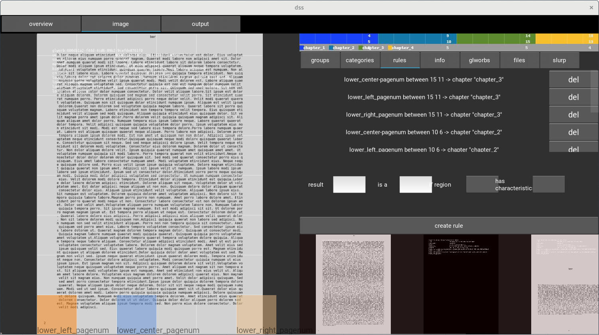

ui for ruling to create "rules" that when run store results with glworb. `lower_left_pagenum between 15 11 -> chapter "chapter_3"` would for a glworb: check the value of the `lower_left_pagenum` key and if it is between the integer range of 11 to 15 store "chapter_3" in the key `chapter`. (see _ruling_ in [machinic-lings](https://github.com/galencm/machinic-lings "https://github.com/galencm/machinic-lings"))

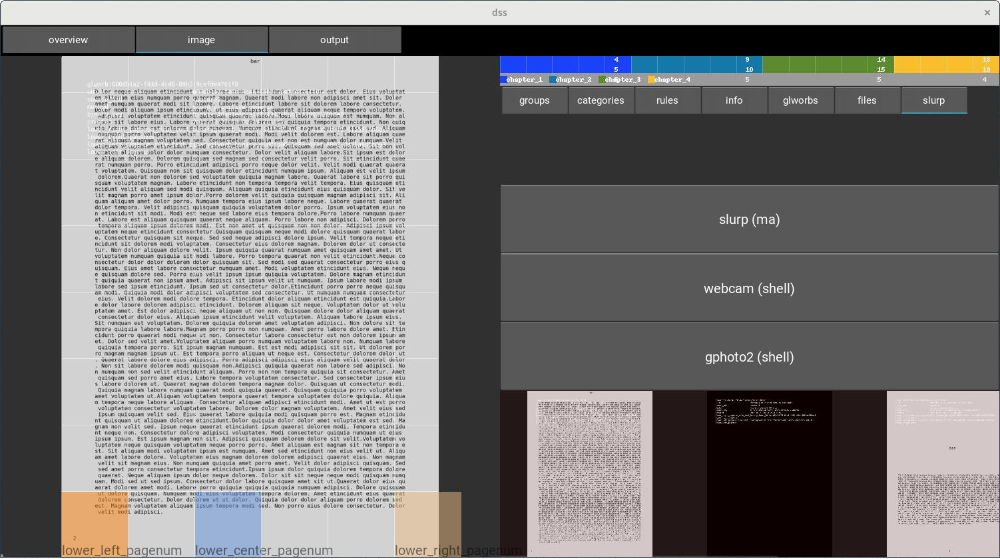

ui to quickly to create glworbs from various sources for testing or minimal setup of regions/categories/rules in a decoupled manner.

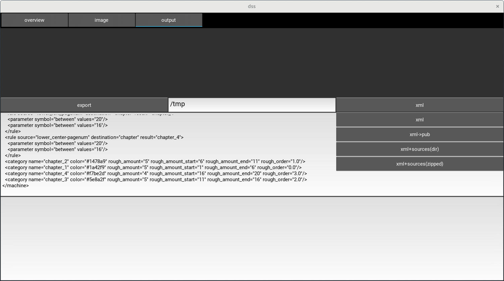

export xml or directly to redis with the design of decoupling setup from other steps of the process. 

* `qma-ui` and `fold-ui` can auto-update these setups from redis or an xml file

* A slightly more advanced version of this decoupling might allow capturing setup images via webcam or a built in camera, selecting regions and then rescaling all regions for the in-process higher resolution devices.


## fold-lattice-ui
[https://github.com/galencm/fold-lattice-ui](https://github.com/galencm/fold-lattice-ui)

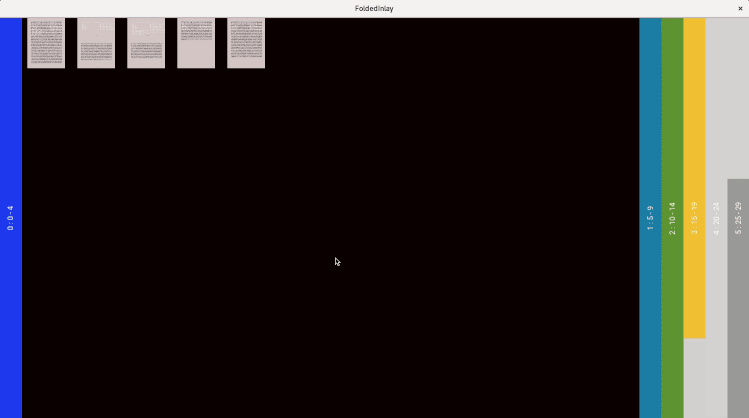

animated gif showing hotkey interaction with fold ui.

Vertical columns are called _folds_, each containing the same(but arbitrary) amount of _rows_. Folds can be selected to show their contents.

Each row represents a glworb and can have different colors/textures, functioning as a symbol/overview for the state of the glworb:
* a color if a binary(image) has been found
* a color if the glworb matches the palette of categories. Categories and colors can be easily defined in `dss-ui`.
* a texture if the glworbs are discontinuous as defined by the categories. For example: several glworbs may be in the same category but have a value such as page_num in the order of 1, 2, 4, 5 that should be continuous and so discontinuities are textured.

The goal is for `fold-ui` to be used to observe progress of the project-in-process in a high-level manner and interact as necessary at lower-levels. Examples: changing orderings, defining canonical sequencing from identical images, exporting a canonical sequence as a finished project.

**Note: for these screenshots, categories were assigned in an arbitrary way. Normally category assignment is done by checking ruling rules**

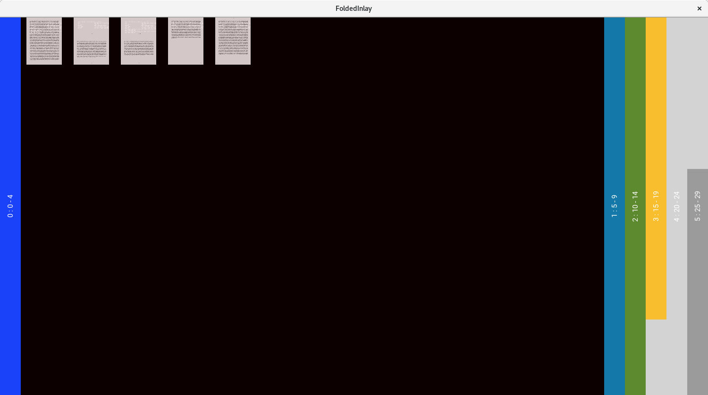

```
fold-ui --size=1500x800 -- --xml-file generated.xml
```

Category coloring with 5 glworbs per fold. The file `generated.xml` was created by `dss-ui`.

The relevant section of xml is:

```
<category name="chapter_1" color="#1a42f9" rough_amount="5" rough_amount_start="1" rough_amount_end="6" rough_order="0.0"/>
<category name="chapter_3" color="#5e8a2f" rough_amount="5" rough_amount_start="11" rough_amount_end="16" rough_order="2.0"/>
<category name="chapter_2" color="#1478a9" rough_amount="5" rough_amount_start="6" rough_amount_end="11" rough_order="1.0"/>
<category name="chapter_4" color="#f7be2d" rough_amount="4" rough_amount_start="16" rough_amount_end="20" rough_order="3.0"/>
```

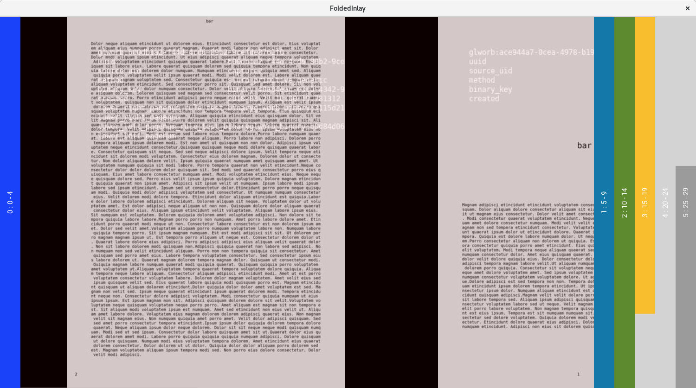

Enlarge (or shrink) within a fold

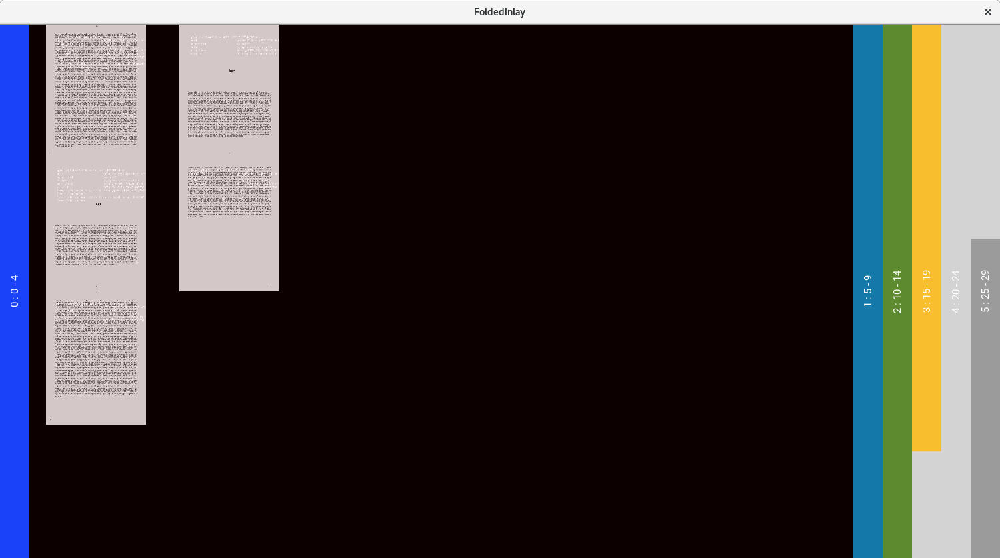

Adjust rows / columns within a fold

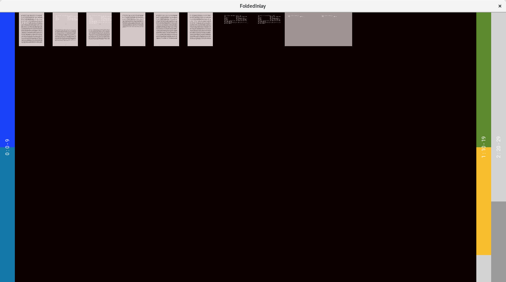

```
fold-ui --size=1500x800 -- --xml-file generated.xml --group-amount 10
```

10 glworbs per fold. Now, using the example xml, ~2 categories can fit per fold compared to the earlier 5 glworbs per fold.

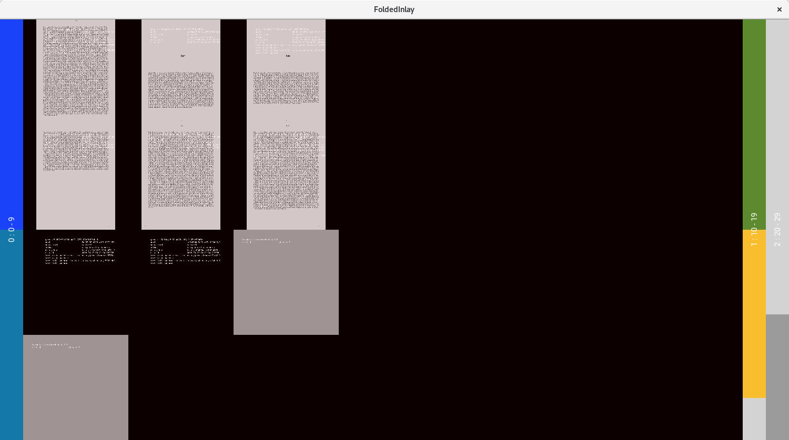

Arbitrary rows / columns within a fold (ranging between 1 column : n rows and n columns : 1 row )

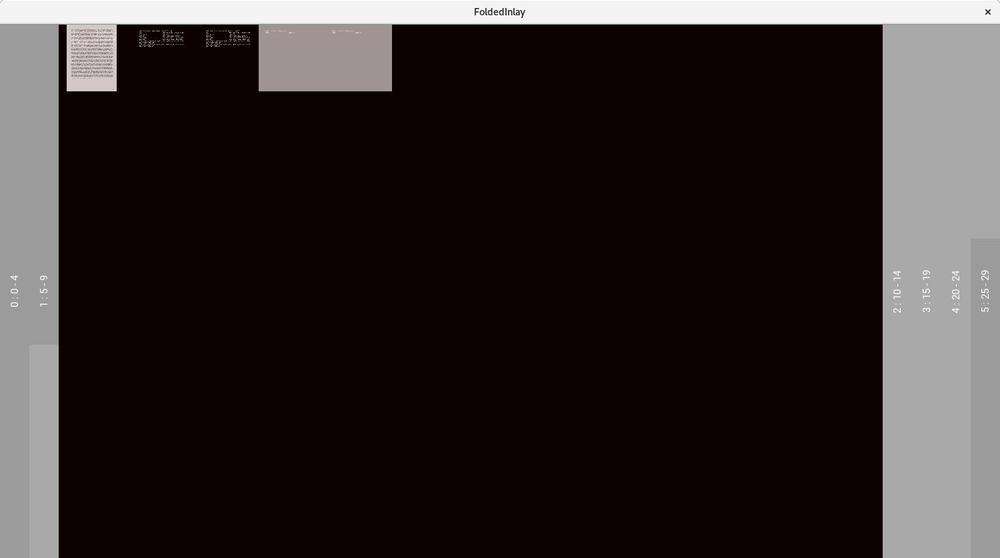

`fold-ui` without any categories

## grids
[https://github.com/galencm/grids](https://github.com/galencm/grids)


animated gif showing cell panning and movement through nested grids.

( gif created using [peek](https://github.com/phw/peek "https://github.com/phw/peek") and resized with [gifsicle](https://github.com/kohler/gifsicle "https://github.com/kohler/gifsicle") )


```
grids --size=900x900 chronology1798_1805.txt chronology1798_1805.txt chronology1798_1805.txt 289956main_lochart.full.2_full.jpg
```

`grids` with multiple files loaded.

## qma-ui
[https://github.com/galencm/qma-ui](https://github.com/galencm/qma-ui)

## vizaviz
[https://github.com/galencm/vizaviz](https://github.com/galencm/vizaviz)


```
python3 vizaviz_gui.py
```

`vizaviz_gui` with four videos (maps) displayed. Video start is at bottom, end at top. Each row is a second with a column of pixels that show most frequent colors. In this case columns of 1, 4, 8, 16, 32 are all shown in a single image for a video.

A process of `vizaviz` and `redis-server` must be running. `vizaviz` and `vizaviz_gui` interact by adding/deleting/modifying values on the redis server. The idea is to allow everything to run on a single box and more flexible configurations such as a box running vizaviz and displaying videos while multiple users are able to interact by connecting to the box. Realtime user field-of-view on the maps is displayed on all guis.


zoom in / enlarge maps


Spectrograms toggled using `tab` if they have been generated.


Loops tab allows more granular adjustment of loop. Here the video and loop are shown at at a resolution of 4 pixels with a column width of 32. The loop region is adjacent. The right side shows all loops currently running.


Mpv playing loops. Loops are run with `mpv` which `vizaviz` controls using mpv's json ipc protocol over a named pipe.


Many potential keybindings for videogame-like approach to rapidly navigate, modify and interact. 

## word-sea
[https://github.com/galencm/word-sea](https://github.com/galencm/word-sea)


```
ws chronologyofpape01muns_djvu.txt | less -R
```

`ws` run without any arguments. Words are colored by frequency in greyscale. Piping the command through `less -R` allows scrolling.


```
ws chronologyofpape01muns_djvu.txt --length-threshold 8 | less -R
```

`ws` run with an argument to ignore words less than the specified length. Ignored words are beigelisted: colored beige instead of greyscale and not used in calculations.


```
ws chronologyofpape01muns_djvu.txt --length-threshold 8 --key-only | less -R
```

`ws` run with an argument to show only the key which shows in sorted order the word by wordcount, coloring used in display and word.
